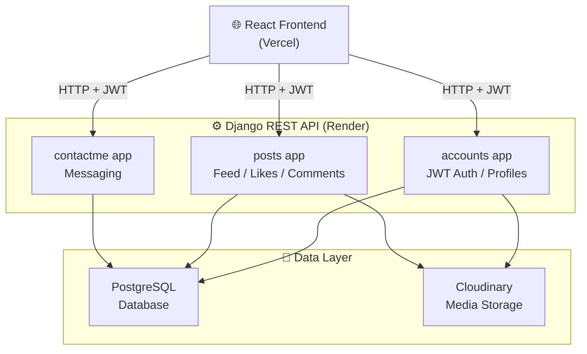
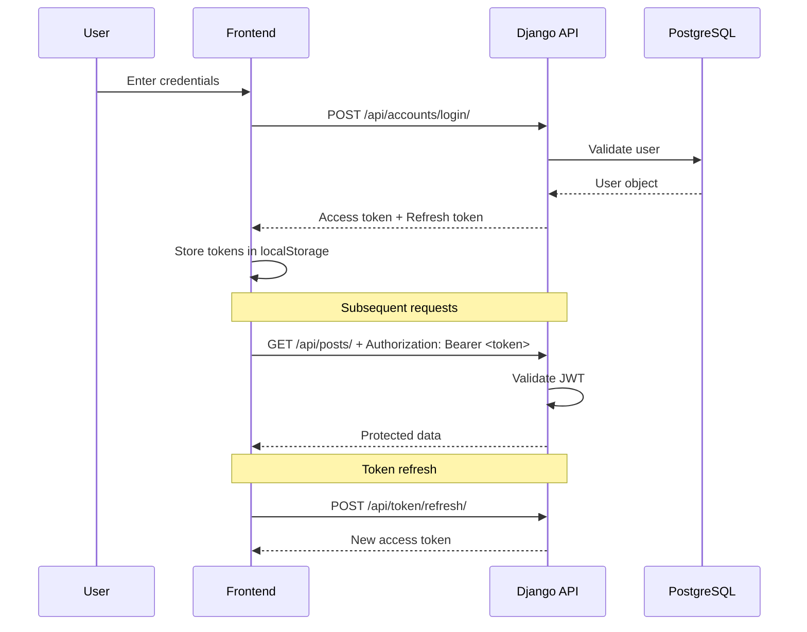
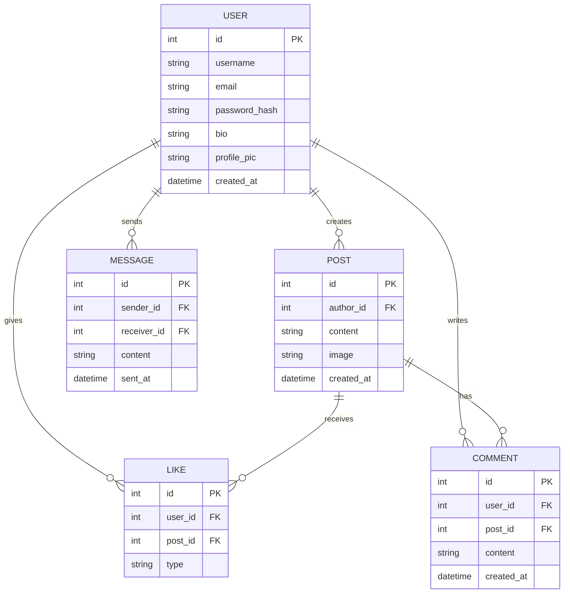

<div align="center">

# 🔗 LinkdPlus — Backend

**A production-grade social networking REST API built with Django REST Framework**

[](https://python.org)
[](https://www.django-rest-framework.org/)
[](https://jwt.io/)
[](https://postgresql.org)
[](https://render.com)

🌐 **Live Frontend →** [linkd-plus-frontend.vercel.app](https://linkd-plus-frontend.vercel.app)
📦 **Frontend Repo →** [LinkdPlus-Frontend](https://github.com/Tushal27/LinkdPlus-Frontend)

</div>

---

## 📖 About

LinkdPlus is a full-stack career social networking platform — built to give professionals a focused space to share updates, connect, and engage. This repo is the Django REST Framework backend, handling all API logic, authentication, and data.

The project is **live and serving real users.** It was built entirely solo — from DB schema design to deployment on Render.

---

## 🏗️ System Architecture



---

## 🔄 Authentication Flow



---

## 🗄️ Database Schema



---

## 🚀 API Endpoints

### Authentication — `/api/accounts/`
| Method | Endpoint | Description |
|--------|----------|-------------|
| `POST` | `/register/` | Register new user |
| `POST` | `/login/` | Login, returns JWT tokens |
| `POST` | `/token/refresh/` | Refresh access token |
| `GET` | `/profile/<id>/` | Get user profile |
| `PUT` | `/profile/update/` | Update profile + photo |

### Posts — `/api/posts/`
| Method | Endpoint | Description |
|--------|----------|-------------|
| `GET` | `/` | Get all posts (feed) |
| `POST` | `/` | Create new post |
| `GET` | `/<id>/` | Get single post |
| `DELETE` | `/<id>/` | Delete post |
| `POST` | `/<id>/like/` | Like / unlike post |
| `POST` | `/<id>/comment/` | Add comment |
| `GET` | `/<id>/comments/` | Get all comments |

### Contact — `/api/contactme/`
| Method | Endpoint | Description |
|--------|----------|-------------|
| `POST` | `/send/` | Send message |
| `GET` | `/inbox/` | Get received messages |

---

## ⚙️ Tech Stack

| Layer | Technology |
|-------|-----------|
| Framework | Django 4.x + Django REST Framework |
| Auth | JWT (SimpleJWT) |
| Database | PostgreSQL |
| Media | Cloudinary |
| Deployment | Render (with `build.sh` + `Procfile`) |
| Runtime | Python 3.11 |

---

## 🛠️ Local Setup

```bash
# 1. Clone the repo
git clone https://github.com/Tushal27/LinkdPLus_backend.git
cd LinkdPLus_backend

# 2. Create virtual environment
python -m venv env
source env/bin/activate  # Windows: env\Scripts\activate

# 3. Install dependencies
pip install -r requirements.txt

# 4. Create .env file
cp .env.example .env
# Fill in: SECRET_KEY, DATABASE_URL, CLOUDINARY_URL

# 5. Run migrations
python manage.py migrate

# 6. Start server
python manage.py runserver
```

### Environment Variables
```env
SECRET_KEY=your_django_secret_key
DATABASE_URL=postgres://...
CLOUDINARY_CLOUD_NAME=...
CLOUDINARY_API_KEY=...
CLOUDINARY_API_SECRET=...
ALLOWED_HOSTS=localhost,127.0.0.1
```

---

## 📁 Project Structure

```
LinkdPLus_backend/
├── accounts/          # User auth, registration, profiles
├── posts/             # Feed, likes, comments
├── contactme/         # Messaging
├── LinkedInapp_Backend/  # Django project settings
├── manage.py
├── requirements.txt
├── Procfile           # Render deployment
├── build.sh           # Render build script
└── runtime.txt        # Python version pin
```

---

<div align="center">

Built with ❤️ by [Tushal J](https://github.com/Tushal27) · [LinkedIn](https://linkedin.com/in/tushal-j)

</div>
